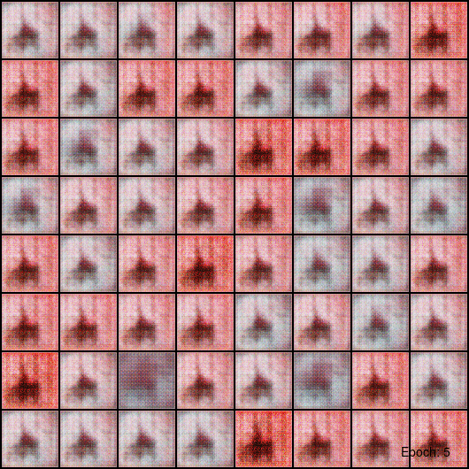
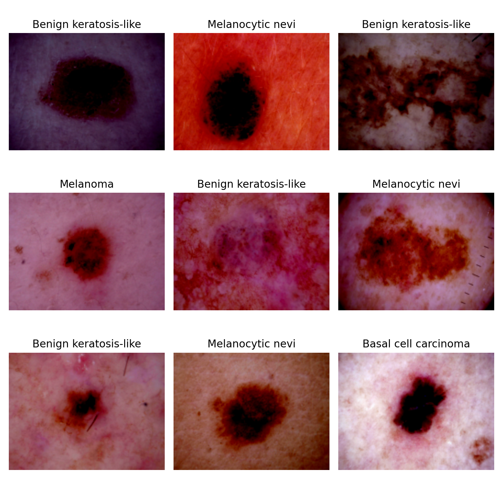
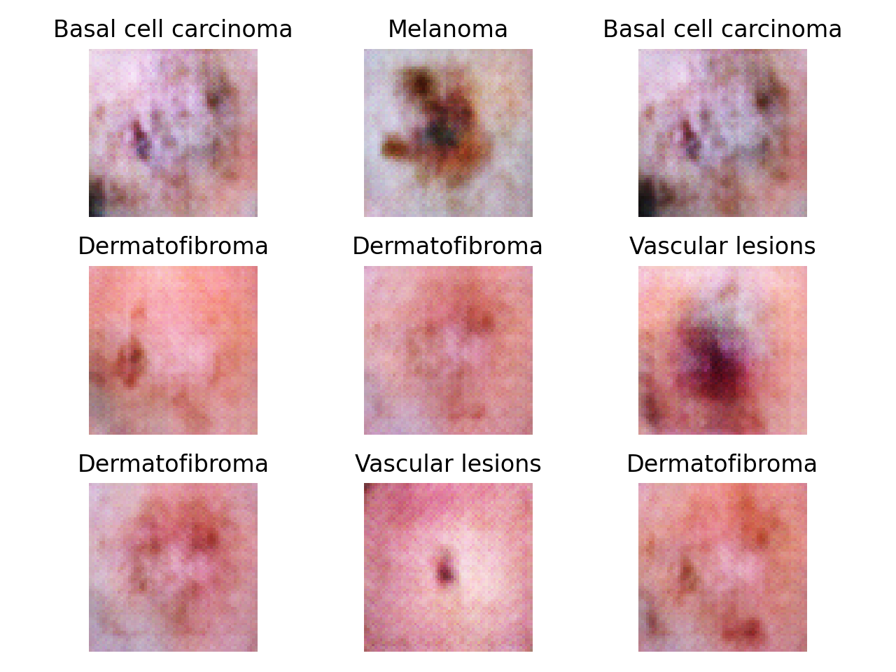
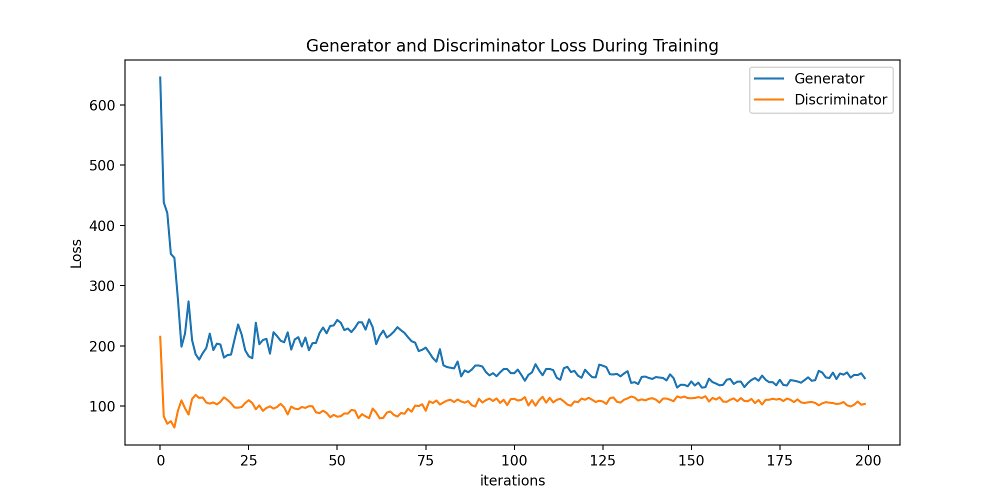

# HAM-cDCGAN

### Class-Conditional Deep Convolutional GANs for Dermatoscopic Image Synthesis

---

## Abstract

Supervised diagnosis of pigmented skin lesions is constrained less by model
capacity than by data: dermatoscopic corpora are small, severely class-imbalanced,
and expensive to annotate under expert supervision. Conditional generative models
offer a route to *class-controllable* sample synthesis, and therefore to
augmentation strategies that can target the minority diagnostic categories
specifically rather than uniformly.

This repository implements and evaluates a **conditional Deep Convolutional
Generative Adversarial Network (cDCGAN)** for the synthesis of 64×64 RGB
dermatoscopic images over the seven diagnostic categories of the HAM10000
dataset. The architecture combines the convolutional inductive biases of DCGAN
[3] with the label-conditioning mechanism of conditional GANs [2], using a
learned dense embedding of the one-hot diagnosis that is concatenated with the
latent code in the generator and broadcast as an additional input plane in the
discriminator.

We report qualitative results after 200 epochs of training under a fixed
hyperparameter configuration, and we analyse the resulting training dynamics.
The principal empirical finding is a **generator/discriminator capacity
imbalance of 11.3×** (31.64 M vs. 2.80 M parameters), which we identify as the
most plausible cause of the loss plateau observed after approximately epoch 50.
No hyperparameter search was performed; the results below should be read as a
reproducible baseline rather than as an optimised system.



> **Figure 1.** Samples decoded from a fixed latent batch $\mathbf{z}_\text{ckpt}$ and a
> fixed label batch $\mathbf{y}_\text{ckpt}$, saved every 5 epochs. Because both
> inputs are held constant across checkpoints, the animation isolates the
> evolution of the generator itself rather than sampling variance.

---

## 1. Introduction

### 1.1 Motivation

Training neural networks for automated diagnosis of pigmented skin lesions is
hampered by the small size and limited diversity of available dermatoscopic
datasets [4]. Three properties of this domain make the problem acute:

1. **Scarcity.** Annotation requires dermatological expertise, and in a
   substantial fraction of cases a definitive label requires histopathological
   confirmation.
2. **Imbalance.** Diagnostic categories follow a long-tailed prevalence
   distribution. In HAM10000, melanocytic nevi account for 66.9% of images,
   while dermatofibroma accounts for 1.1% (§3.2).
3. **Privacy.** Dermatoscopic images are patient data. Sharing is subject to
   consent and governance constraints that synthetic surrogates could, in
   principle, relax.

Generative augmentation addresses (1) and (2) directly, and has been reported to
improve downstream CNN classification in other medical imaging modalities [7].
The *conditional* formulation is what makes (2) tractable: an unconditional
generator trained on a long-tailed corpus will reproduce that same long tail,
whereas a conditional generator can be sampled uniformly over classes.

### 1.2 Contributions

This repository provides:

- **C1.** A complete, seeded, single-file-configurable PyTorch implementation of
  a cDCGAN for 64×64 dermatoscopic synthesis, conditioned on all seven HAM10000
  diagnostic categories (`hamgan/gan.py`).
- **C2.** Unconditional DCGAN baselines at both 64×64 and 128×128 resolution,
  for ablation against the conditioning mechanism.
- **C3.** A reproducible training pipeline with deterministic seeding, fixed
  checkpoint noise for longitudinal visual comparison, and periodic model
  serialisation (`hamgan/train.py`).
- **C4.** An explicit, quantified diagnosis of the failure mode observed in this
  configuration (§7.1), together with a prioritised roadmap for addressing it
  (§9).

### 1.3 Scope and non-claims

This is a **research prototype**. It is not a diagnostic device, and the
synthetic images it produces are not clinically validated. See §11.
We explicitly do *not* claim: state-of-the-art sample fidelity, a measured
downstream augmentation benefit, or any evaluation against FID [5] or
Inception Score [6]. Those are open items (§9), and their absence is the main
limitation of the present results.

---

## 2. Related Work

| Line of work | Reference | Relation to this project |
| --- | --- | --- |
| Adversarial training | Goodfellow et al., 2014 [1] | Underlying minimax objective |
| Conditional GANs | Mirza & Osindero, 2014 [2] | Source of the label-conditioning mechanism used here |
| DCGAN | Radford et al., 2016 [3] | Source of the convolutional backbone and of the hyperparameters in §5 |
| HAM10000 | Tschandl et al., 2018 [4] | Training corpus |
| GAN augmentation in medical imaging | Frid-Adar et al., 2018 [7] | Motivating evidence that synthetic augmentation improves downstream CNNs |
| Auxiliary-classifier GAN | Odena et al., 2017 [8] | Alternative conditioning; candidate ablation (§9) |
| Projection discriminator | Miyato & Koyama, 2018 [9] | Stronger conditioning than input concatenation; candidate ablation (§9) |
| Spectral normalisation | Miyato et al., 2018 [10] | Candidate stabilisation for the imbalance in §7.1 |
| WGAN-GP | Gulrajani et al., 2017 [11] | Alternative objective with better-behaved gradients |
| Limited-data augmentation | Karras et al., 2020 [12] | Directly relevant to the 6 k-image training regime here |

The present work sits at the simplest point of this design space by
construction: input-concatenation conditioning, BCE loss, no normalisation
beyond BatchNorm. That choice is deliberate — it establishes the baseline
against which [8], [9], [10] and [11] can be ablated.

---

## 3. Data

### 3.1 HAM10000

We use the **HAM10000** dataset ("Human Against Machine with 10000 training
images") [4]. The corpus aggregates dermatoscopic images from multiple
populations, acquired and stored under different modalities, and harmonised by
the authors through semi-automatic cleaning workflows. The released set contains
**10,015 dermatoscopic images** spanning all major diagnostic categories of
pigmented lesions. More than half of the lesions are confirmed by
histopathology; the remainder are established by follow-up examination, expert
consensus, or in-vivo confocal microscopy.

**Availability.** The dataset is mirrored at:

- [Harvard Dataverse](https://dataverse.harvard.edu/dataset.xhtml?persistentId=doi:10.7910/DVN/DBW86T) (canonical)
- [ISIC Archive](https://challenge.isic-archive.com/landing/2018/)
- [Kaggle](https://www.kaggle.com/datasets/kmader/skin-cancer-mnist-ham10000) — **the mirror used in this work**

**Licence.** HAM10000 is distributed under **CC BY-NC 4.0**. It is *not*
redistributed in this repository, and downstream users inherit the
non-commercial restriction. See §11.

### 3.2 Class distribution

| Label | Diagnostic category | Class index | *n* | Share |
| --- | --- | ---: | ---: | ---: |
| `nv` | Melanocytic nevi | 5 | 6,705 | 66.95% |
| `mel` | Melanoma | 4 | 1,113 | 11.11% |
| `bkl` | Benign keratosis-like lesions | 2 | 1,099 | 10.97% |
| `bcc` | Basal cell carcinoma | 1 | 514 | 5.13% |
| `akiec` | Actinic keratoses / intraepithelial carcinoma | 0 | 327 | 3.27% |
| `vasc` | Vascular lesions | 6 | 142 | 1.42% |
| `df` | Dermatofibroma | 3 | 115 | 1.15% |
| | **Total** | | **10,015** | 100% |

The imbalance ratio between the majority and minority class is **58:1**. This is
the single most consequential property of the dataset for the present work, and
it is *not* currently compensated for in the sampler (§8, I-4).

### 3.3 Metadata schema

`HAM10000_metadata.csv` provides one row per image:

| Column | Description |
| --- | --- |
| `image_id` | Filename stem; resolved against `HAM10000_images_part_1` or `part_2` |
| `lesion_id` | Lesion identifier — **one lesion may yield several images** |
| `dx` | Ground-truth diagnosis (the conditioning label $y$) |
| `dx_type` | How `dx` was established: `histo`, `follow_up`, `consensus`, `confocal` |
| `age`, `sex`, `localization` | Patient covariates; currently unused |

> **Note on `lesion_id`.** Because multiple images may share a lesion, a
> random image-level split (as implemented in `hamgan/data.py`) leaks lesions
> across the train/validation/test boundary. This does not affect the
> generative results reported here, which use only the training split, but it
> **must** be corrected to a group-wise split before any downstream classifier
> is evaluated. Tracked as I-5 in §8.

### 3.4 Preprocessing and splits

Images are resized to $64 \times 64$ and converted to tensors. The
normalisation applied is `Normalize(mean=0, std=1)`, which is the **identity**
map — images therefore remain in $[0, 1]$. This is intentional, and matches the
`Sigmoid` output activation of the conditional generator. The unconditional
baselines terminate in `Tanh` and expect $[-1, 1]$; switching to them requires
changing the normalisation accordingly.

The dataset is split **60 / 20 / 20** into train, validation and test partitions
using a seeded generator (`SEED = 42`), giving approximately **6,009 training
images**. Only the training split is consumed by the adversarial objective;
the validation and test loaders are constructed but reserved for the downstream
evaluation described in §9.

---

## 4. Method

### 4.1 Problem formulation

Let $\mathbf{x} \in [0,1]^{3\times 64 \times 64}$ be a dermatoscopic image and
$\mathbf{y} \in \{0,1\}^{7}$ its one-hot diagnosis. We seek a generator
$G_\theta : \mathbb{R}^{128} \times \{0,1\}^{7} \rightarrow [0,1]^{3\times64\times64}$
such that, for each class $y$, the induced conditional distribution matches the
real class-conditional data distribution.

Following [1] and [2], $G_\theta$ is trained adversarially against a
discriminator $D_\phi$ under the conditional minimax objective

$$
\min_{\theta}\;\max_{\phi}\;
\mathbb{E}_{(\mathbf{x},\mathbf{y}) \sim p_\text{data}} \big[\log D_\phi(\mathbf{x}\mid\mathbf{y})\big]
+
\mathbb{E}_{\mathbf{z} \sim \mathcal{N}(0, I),\, \mathbf{y} \sim p(\mathbf{y})} \big[\log\big(1 - D_\phi(G_\theta(\mathbf{z},\mathbf{y})\mid\mathbf{y})\big)\big].
$$

In practice both networks are optimised with the **non-saturating** heuristic of
[1]: rather than minimising $\log(1 - D(G(\mathbf{z},\mathbf{y})))$, the
generator maximises $\log D(G(\mathbf{z},\mathbf{y}))$. This is implemented by
reusing a single `BCELoss` and flipping the target label to *real* on the
generator step (`hamgan/train.py`).

An important implementation detail: on each step, the **label batch
$\mathbf{y}$ is taken from the real data batch**, not sampled independently.
The discriminator therefore never sees a mismatched (image, label) pair, and so
is never trained to reject *wrong-class* samples — only *fake* ones. This is a
known weakness of the concatenation-conditioning scheme relative to [8] and [9],
and is the likely reason class-conditional control is weaker than sample
realism.

### 4.2 Conditioning mechanism

Both networks embed the one-hot label through a learned dense layer before
fusion, but they fuse at different points:

- **Generator** — the label is embedded to $\mathbb{R}^{1000}$ and the latent
  code to $\mathbb{R}^{256}$; the two are concatenated into a $1256$-dimensional
  vector and reshaped to a $1256 \times 1 \times 1$ feature map that seeds the
  transposed-convolution stack. Conditioning thus enters **once, at the lowest
  spatial resolution**, and must propagate through the whole decoder.
- **Discriminator** — the label is embedded to $\mathbb{R}^{4096}$, reshaped to
  a $1 \times 64 \times 64$ **label plane**, and concatenated to the image as a
  fourth input channel. Conditioning thus enters **at full spatial resolution**,
  spatially uniform per class.

### 4.3 Generator architecture

Conditioning branches:

| Branch | Layer | Shape |
| --- | --- | --- |
| Latent | `Linear(128 → 256)` + `ReLU` | $(B, 256)$ |
| Label | `Linear(7 → 1000)` + `ReLU` | $(B, 1000)$ |
| Fusion | `concat` → `view` | $(B, 1256, 1, 1)$ |

Decoder (`ngf = 128`, `nc = 3`; all transposed convolutions are $4\times4$, bias-free):

| # | Operation | Stride / Pad | Output shape |
| ---: | --- | :---: | --- |
| 1 | `ConvT(1256 → 1024)` + `BN` + `ReLU` | 1 / 0 | $1024 \times 4 \times 4$ |
| 2 | `ConvT(1024 → 512)` + `BN` + `ReLU` | 2 / 1 | $512 \times 8 \times 8$ |
| 3 | `ConvT(512 → 256)` + `BN` + `ReLU` | 2 / 1 | $256 \times 16 \times 16$ |
| 4 | `ConvT(256 → 128)` + `BN` + `ReLU` | 2 / 1 | $128 \times 32 \times 32$ |
| 5 | `ConvT(128 → 3)` + `Sigmoid` | 2 / 1 | $3 \times 64 \times 64$ |

**Total: 31,639,360 parameters.** Layer 1 alone accounts for 20.58 M (65.0% of
the generator), a direct consequence of the 1256-channel fused input.

### 4.4 Discriminator architecture

| Branch | Layer | Shape |
| --- | --- | --- |
| Label | `Linear(7 → 4096)` + `ReLU` → `view` | $(B, 1, 64, 64)$ |
| Fusion | `concat` with image | $(B, 4, 64, 64)$ |

Encoder (`ndf = 64`; all convolutions are $4\times4$, bias-free; `LeakyReLU(0.2)`):

| # | Operation | Stride / Pad | Output shape |
| ---: | --- | :---: | --- |
| 1 | `Conv(4 → 64)` + `LReLU` | 2 / 1 | $64 \times 32 \times 32$ |
| 2 | `Conv(64 → 128)` + `BN` + `LReLU` | 2 / 1 | $128 \times 16 \times 16$ |
| 3 | `Conv(128 → 256)` + `BN` + `LReLU` | 2 / 1 | $256 \times 8 \times 8$ |
| 4 | `Conv(256 → 512)` + `BN` + `LReLU` | 2 / 1 | $512 \times 4 \times 4$ |
| 5 | `Conv(512 → 1)` + `Sigmoid` | 1 / 0 | $1 \times 1 \times 1$ |

**Total: 2,799,360 parameters.**

### 4.5 Initialisation

Following [3], all weights are initialised from a normal distribution:
convolutional weights from $\mathcal{N}(0, 0.02^2)$, BatchNorm scales from
$\mathcal{N}(1, 0.02^2)$, and BatchNorm biases to zero.

---

## 5. Experimental Setup

### 5.1 Hyperparameters

All values are declared in `hamgan/static.py` and are reproduced verbatim below.
Optimiser settings follow DCGAN [3] without modification.

| Parameter | Symbol | Value |
| --- | --- | ---: |
| Random seed | `SEED` | 42 |
| Image resolution | `IMAGE_SIZE` | 64 |
| Latent dimension | `nz` | 128 |
| Generator feature depth | `ngf` | 128 |
| Discriminator feature depth | `ndf` | 64 |
| Colour channels | `nc` | 3 |
| Label embedding width | `n_dnn` | 1000 |
| Number of classes | `NUM_CLASSES` | 7 |
| Batch size | `BATCH_SIZE` | 64 |
| Epochs | `NUM_EPOCHS` | 200 |
| Learning rate | $\eta$ | $2\times10^{-4}$ |
| Adam $\beta_1$ | `BETA_1` | 0.5 |
| Adam $\beta_2$ | — | 0.999 |
| Loss | — | Binary cross-entropy |
| Dataloader workers | `NUM_WORKERS` | $4 \times n_\text{GPU}$ |
| Checkpoint interval | `_freq` | 5 epochs |

At `BATCH_SIZE = 64` over ~6,009 training images, one epoch is **94 iterations**,
giving **≈18,800 generator updates** over the full 200-epoch run, and **40
checkpoints**.

### 5.2 Determinism

`seed_everything()` fixes `random`, `numpy`, `PYTHONHASHSEED`, `torch`, and
`torch.cuda`, and sets `cudnn.deterministic = True`. The split generator is
seeded independently with the same value. Bitwise reproducibility across
different GPU architectures or cuDNN versions is nonetheless not guaranteed.

### 5.3 Checkpoint protocol

A single noise batch $\mathbf{z}_\text{ckpt}$ and label batch
$\mathbf{y}_\text{ckpt}$ are drawn **once, at module import**, and reused at
every checkpoint. Holding both fixed means that any visual change across Figure 1
is attributable to $\theta$ alone. Generator and discriminator state dicts are
written to `models/` on the same schedule.

---

## 6. Results

All results below are from a single run at `IMAGE_SIZE = 64` under the
configuration of §5.1. No hyperparameter search was performed.

### 6.1 Real reference samples



> **Figure 2.** Nine images drawn at random from HAM10000 after the resize-to-64
> preprocessing of §3.4, titled with their ground-truth diagnosis. These
> establish the target distribution: note the characteristic circular
> dermatoscope vignette, the variation in illumination and colour balance
> across acquisition sites, and the presence of hair and ruler artefacts.

### 6.2 Conditionally synthesised samples



> **Figure 3.** Nine samples decoded from $\mathbf{z} \sim \mathcal{N}(0, I)$ with
> arbitrary class labels, using the generator at the end of training.

The model reliably recovers the **global structure** of the domain — the
circular field of view, a central lesion against a skin-toned background, and a
plausible colour distribution. It does **not** recover fine dermatoscopic
structure: pigment networks, globules, streaks and vascular patterns, which are
precisely the features a diagnostic classifier depends on, are not resolved at
64×64. Class-conditional separation is visible but weak, consistent with the
conditioning analysis in §4.1.

### 6.3 Training dynamics



> **Figure 4.** Per-epoch accumulated generator and discriminator loss.
> Note that the plotted quantity is the **sum** over the 94 iterations in an
> epoch, not the mean, and that the axis is mislabelled `iterations` in the
> current code (§8, I-6). Magnitudes are therefore not comparable across
> different batch sizes.

The discriminator loss reaches a plateau early and does not recover. Once
$D_\phi$ stops improving, the gradient signal it supplies to $G_\theta$ becomes
approximately stationary, and generator improvement stalls with it — the
adversarial game settles into a degenerate equilibrium well short of
convergence. §7.1 quantifies the most likely cause.

---


## 7. Roadmap

Ordered by expected impact per unit of effort:

1. **Rebalance capacity** — `ndf: 64 → 128`, `n_dnn: 1000 → 128`; re-measure the
   loss plateau (§7.1).
2. **Rebalance classes** — `WeightedRandomSampler` with inverse-frequency
   weights (§7.2).
3. **Quantify** — implement FID [5] and Inception Score [6] against a held-out
   real split; report per-class FID to expose conditioning quality.
4. **Fix I-1, I-2, I-6** — CLI, device placement, rescaling convention.
5. **Strengthen conditioning** — ablate input concatenation against the
   auxiliary classifier of [8] and the projection discriminator of [9]; sample
   labels independently of the real batch so $D_\phi$ learns to reject
   mismatched pairs (§4.1).
6. **Stabilise** — spectral normalisation [10] or WGAN-GP [11]; adaptive
   discriminator augmentation [12] is well matched to the ~6 k-image regime.
7. **Scale** — implement the conditional 128×128 architecture (I-3).
8. **Validate the premise** — train a classifier on real data, then on real +
   synthetic, and report the delta on the untouched test split. This is the
   experiment that determines whether the project succeeded.

---

## 8. Reproducing the Results

### 8.1 Environment

Training was performed locally with GPU support via CUDA 11.8 and a compatible
cuDNN. On Windows, cuDNN files must be copied into
`C:\Program Files\NVIDIA GPU Computing Toolkit\CUDA\v11.8`. PyTorch is then
installed per the [official selector](https://pytorch.org/get-started/locally/#anaconda).

```bash
conda create -n hamgan python=3.9
conda activate hamgan
conda install pytorch torchvision torchaudio pytorch-cuda=11.8 -c pytorch -c nvidia -y
conda install jupyter notebook pandas matplotlib seaborn colorama -y
```

> `colorama` is required by `hamgan/logger.py` and was missing from earlier
> instructions (I-9). PyTorch **≥ 1.13** is required: `random_split` is called
> with fractional lengths, which older releases do not accept.

Optional — register the environment as a Jupyter kernel:

```bash
python -m ipykernel install --user --name=hamgan
```

### 8.2 Expected data layout

Download HAM10000 and arrange it as follows. The directory is
gitignored and the dataset is not redistributed here.

```
data/
├── HAM10000_metadata.csv
├── HAM10000_images_part_1/     # 5,000 .jpg
└── HAM10000_images_part_2/     # 5,015 .jpg
```

### 8.3 Running

Until I-1 is resolved, invoke the entry point programmatically:

```python
from hamgan.main import main

# Train from scratch
main(save_best_model=True, save_generated_images=True, verbose=True)

# Or load a serialised generator and sample from it
main(load_model=True)
```

Outputs are written to `output/` (checkpoint image grids), `models/`
(`generator.pth`, `discriminator.pth`) and `.img/` (figures).

### 8.4 Repository structure

```
hamgan/
├── static.py       # Central configuration: all hyperparameters of §5.1
├── data.py         # HAM10000Dataset, transforms, 60/20/20 split, dataloaders
├── gan.py          # cDCGAN (64) + unconditional DCGAN baselines (64, 128)
├── train.py        # Adversarial loop, seeding, checkpointing, loss plotting
├── validation.py   # Qualitative evaluation — Figures 2 and 3
├── logger.py       # Singleton coloured logger
└── main.py         # Entry point and CLI
.img/               # Figures referenced by this document
```

Configuration is centralised: `static.py` is the only file that needs editing to
change resolution, capacity, or optimisation settings.

---


## References

1. I. J. Goodfellow, J. Pouget-Abadie, M. Mirza, B. Xu, D. Warde-Farley, S. Ozair, A. Courville, Y. Bengio. *Generative Adversarial Nets*. NeurIPS, 2014. [arXiv:1406.2661](https://arxiv.org/abs/1406.2661)
2. M. Mirza, S. Osindero. *Conditional Generative Adversarial Nets*. 2014. [arXiv:1411.1784](https://arxiv.org/abs/1411.1784)
3. A. Radford, L. Metz, S. Chintala. *Unsupervised Representation Learning with Deep Convolutional Generative Adversarial Networks*. ICLR, 2016. [arXiv:1511.06434](https://arxiv.org/abs/1511.06434)
4. P. Tschandl, C. Rosendahl, H. Kittler. *The HAM10000 dataset, a large collection of multi-source dermatoscopic images of common pigmented skin lesions*. Scientific Data 5:180161, 2018. [doi:10.1038/sdata.2018.161](https://doi.org/10.1038/sdata.2018.161) · [arXiv:1803.10417](https://arxiv.org/abs/1803.10417)
5. M. Heusel, H. Ramsauer, T. Unterthiner, B. Nessler, S. Hochreiter. *GANs Trained by a Two Time-Scale Update Rule Converge to a Local Nash Equilibrium*. NeurIPS, 2017. [arXiv:1706.08500](https://arxiv.org/abs/1706.08500)
6. T. Salimans, I. Goodfellow, W. Zaremba, V. Cheung, A. Radford, X. Chen. *Improved Techniques for Training GANs*. NeurIPS, 2016. [arXiv:1606.03498](https://arxiv.org/abs/1606.03498)
7. M. Frid-Adar, I. Diamant, E. Klang, M. Amitai, J. Goldberger, H. Greenspan. *GAN-based synthetic medical image augmentation for increased CNN performance in liver lesion classification*. Neurocomputing 321:321–331, 2018. [arXiv:1803.01229](https://arxiv.org/abs/1803.01229)
8. A. Odena, C. Olah, J. Shlens. *Conditional Image Synthesis with Auxiliary Classifier GANs*. ICML, 2017. [arXiv:1610.09585](https://arxiv.org/abs/1610.09585)
9. T. Miyato, M. Koyama. *cGANs with Projection Discriminator*. ICLR, 2018. [arXiv:1802.05637](https://arxiv.org/abs/1802.05637)
10. T. Miyato, T. Kataoka, M. Koyama, Y. Yoshida. *Spectral Normalization for Generative Adversarial Networks*. ICLR, 2018. [arXiv:1802.05957](https://arxiv.org/abs/1802.05957)
11. I. Gulrajani, F. Ahmed, M. Arjovsky, V. Dumoulin, A. Courville. *Improved Training of Wasserstein GANs*. NeurIPS, 2017. [arXiv:1704.00028](https://arxiv.org/abs/1704.00028)
12. T. Karras, M. Aittala, J. Hellsten, S. Laine, J. Lehtinen, T. Aila. *Training Generative Adversarial Networks with Limited Data*. NeurIPS, 2020. [arXiv:2006.06676](https://arxiv.org/abs/2006.06676)

### Further reading — related corpora

- [MedMNIST v2](https://medmnist.com/) — standardised MNIST-like biomedical image collections
- [TorchIO datasets](https://torchio.readthedocs.io/datasets.html) — medical imaging datasets for PyTorch
- [Dermatology Image Bank, University of Utah](https://library.med.utah.edu/kw/derm/)
- General repositories: [Zenodo](https://zenodo.org/) · [Hugging Face Datasets](https://huggingface.co/docs/datasets/)

---
